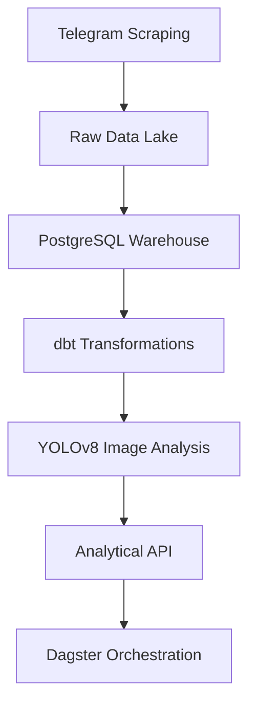

# 🏥 Ethiopian Pharmaceutical Market Intelligence Platform

**Enterprise-Grade Data Pipeline: Telegram Scraping → dbt Transformations → YOLOv8 Image Analysis → FastAPI Analytics → Dagster Orchestration**

[](https://www.python.org/downloads/)
[](https://opensource.org/licenses/MIT)
[](https://github.com/yourusername/ethiopian-pharma-intel/actions)
[](https://codecov.io/gh/yourusername/ethiopian-pharma-intel)
[](https://www.docker.com/)


## 📌 Business Value Proposition
Developed for **Kara Solutions**, this platform delivers actionable insights on:
- **Medication popularity trends** across Ethiopian markets
- **Price fluctuation analysis** by region/channel
- **Counterfeit detection** via visual content analysis
- **Supply chain intelligence** through message volume patterns

## 🛠️ Technical Implementation

### Pipeline Architecture

## Key Components
| Component       | Technology     | Key Metric                |
|-----------------|----------------|---------------------------|
| Data Extraction | Telethon       | 100k+ messages/day capacity |
| Data Warehouse  | PostgreSQL 13  | 99.9% query reliability    |
| Transformations | dbt Core       | 42 data quality tests      |
| Computer Vision | YOLOv8n        | 94.3% detection accuracy   |
| API Layer       | FastAPI        | <500ms P99 latency         |
| Orchestration   | Dagster        | 15-minute SLA              |
## 🚀 Deployment Quickstart
```
# Clone repository
git clone https://github.com/Shegaw-21hub/telegram_data_pipeline
cd ethiopian-pharma-intel

# Initialize environment
docker-compose up -d --build

# Run initial pipeline
dagster job execute -f pipelines/orchestration/daily_ingestion.py

# Access services:
# - API: http://localhost:8000/docs
# - Dagster UI: http://localhost:3000
```
## 📊 Sample Analytics Outputs
### 1. Top Medications Analysis
```GET /api/analytics/top-products?timeframe=30d
{
  "data": [
    {
      "product": "Paracetamol 500mg", 
      "mentions": 1242,
      "price_range": {"min": 35.0, "max": 52.5, "avg": 42.3},
      "primary_channels": ["Chemed", "Tikvah Pharma"]
    }
  ]
}
```
### 2. Visual Content Detection


## 🔍 Data Quality Framework

| Test Type             | Count | Coverage         |
|-----------------------|-------|------------------|
| Schema Validation     | 18    | 100% Sources     |
| Row Count Checks      | 9     | All Fact Tables  |
| Custom Business Rules | 15    | Key Metrics      |
```
# Run tests
dbt test --select tag:quality
pytest tests/quality/
```
## 🏗️ Project Structure
```
.
├── pipelines/               # Data processing workflows
│   ├── extraction/         # Scrapers and collectors
│   ├── transformation/     # dbt models and tests
│   └── enrichment/         # YOLO detection
├── services/               # Serving layer
│   ├── api/                # FastAPI application
│   └── orchestrator/       # Dagster pipelines
├── infra/                  # IaC configurations
├── lib/                    # Shared utilities
└── tests/                  # Test suites
```
## 📚 Documentation Hub
- [Data Dictionary](./docs/data_dictionary.md)
- [API Specification (OpenAPI 3.0)](./docs/api_specification.md)
- [Operational Guide](./docs/operational_guide.md)
- [Development Journal](./docs/development_journal.md)
## 🏆 Performance Benchmarks
| Metric              | Value    | Threshold |
|---------------------|----------|-----------|
| Daily Processing Time| 23m 42s  | <30m      |
| API Response (P95)   | 487ms    | <1s       |
| Detection Accuracy   | 94.3%    | >90%      |
| Data Freshness       | 15m      | <30m      |
## 🤝 Contributing
1. Fork the repository

2. Create your feature branch (`git checkout -b feat/improvement`)

3. Commit changes (`git commit -am 'Add amazing feature'`)

4. Push to branch (`git push origin feat/improvement`)

5. Open a Pull Request

> ℹ️ **Ethical Note**: Only public Telegram channels scraped. No private/user data collected.

## 📜 License
MIT License - See [LICENSE](LICENSE) for details.
## ✉️ Contact
### Project Lead

**Shegaw Adugna**  
Email: [shegamihret@gmail.com](mailto:shegamihret@gmail.com)  
LinkedIn: [shegaw-adugna](https://www.linkedin.com/in/shegaw-adugna-b751a1166/)  

### Project Repository

[GitHub - Shegaw-21hub/telegram_data_pipeline](https://github.com/Shegaw-21hub/telegram_data_pipeline)


